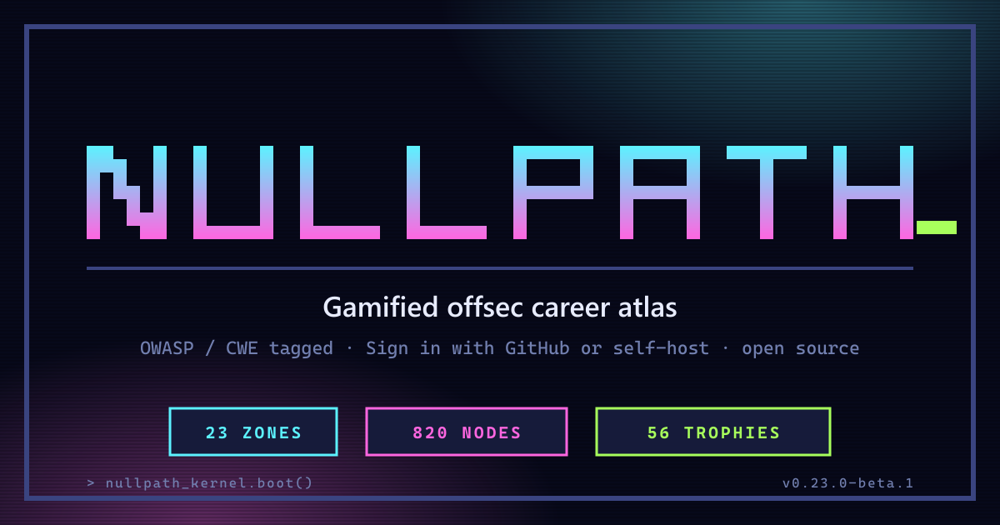
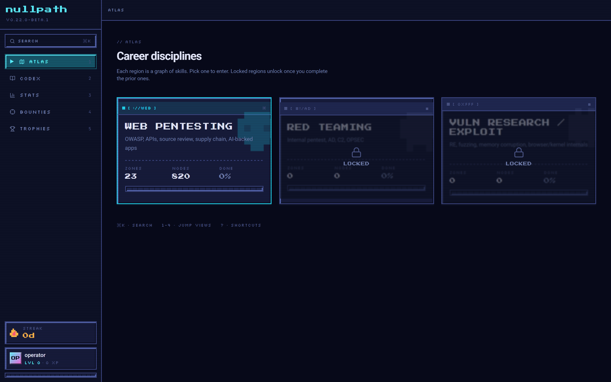
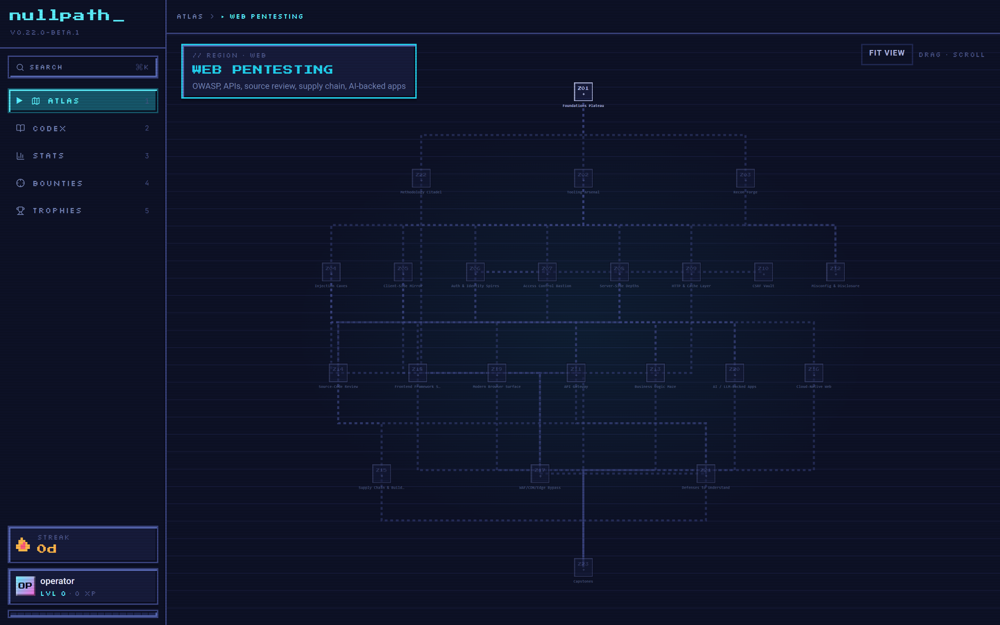
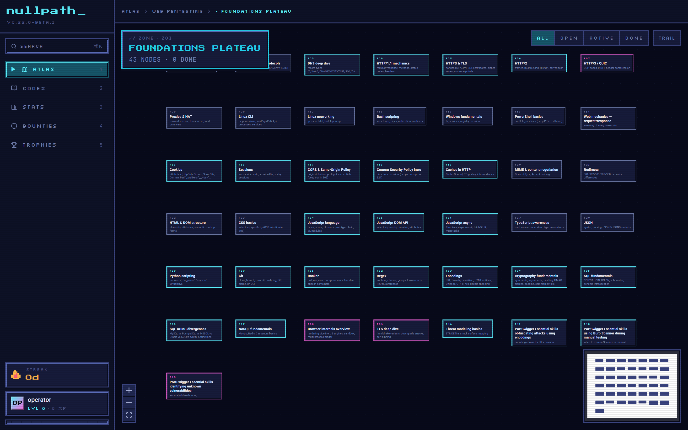
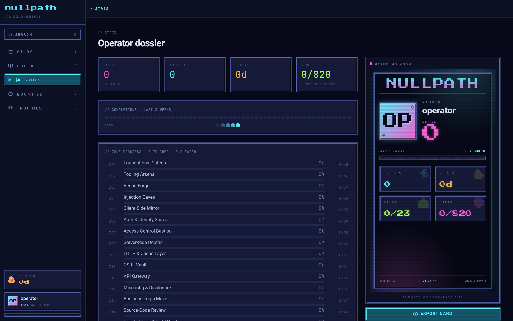
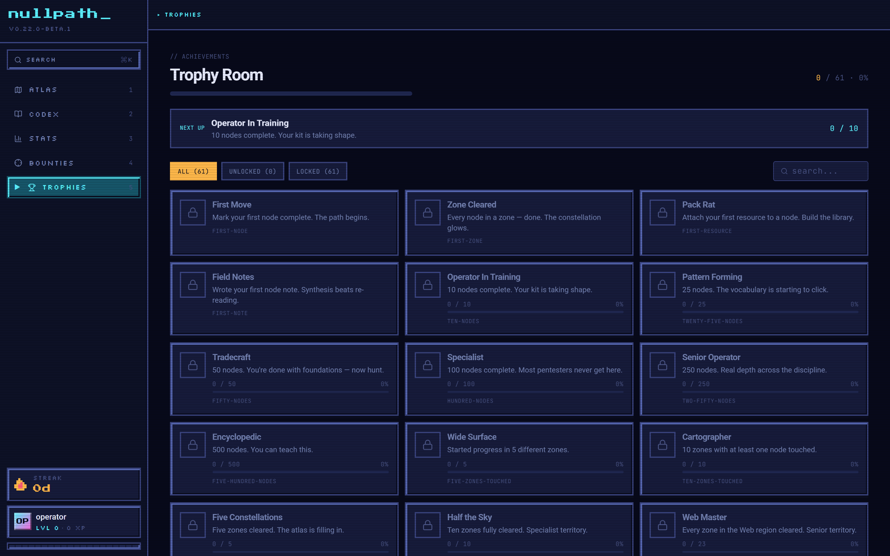
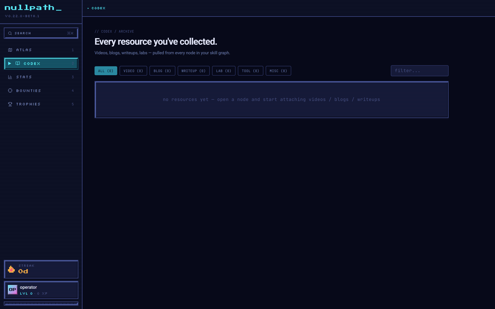

# Nullpath

> **Gamified offsec career atlas.** 23 zones · 820 verified web-pentest
> skills · OWASP / CWE tagged · 56 trophies · browser-native ·
> local-first.



Turns offensive-security learning into a constellation of skills you
explore, complete, and revisit. Learning happens **outside** the app —
PortSwigger Web Security Academy, HackTheBox, TryHackMe, books, CTFs,
real bug bounties. Nullpath is the dashboard that turns all of it into
visible progress.

Runs entirely in the browser. Two modes:

- **Cloud mode** (the hosted build at nullpath-one.vercel.app). Sign
  in with GitHub, your progress syncs to a Postgres database via
  Supabase, every per-user row is row-level-security isolated. No
  passwords on our side — auth is delegated to GitHub.
- **Local mode** (the default for self-hosters). The app runs entirely
  in your browser. Your data lives in IndexedDB on your device,
  nothing leaves your machine. No account, no server.

Mode is selected at build time by the presence of `VITE_SUPABASE_URL`
and `VITE_SUPABASE_ANON_KEY` env vars; absent → local, present → cloud.
See [`docs/setup-auth.md`](./docs/setup-auth.md) for the cloud setup
walkthrough.

## Demo


_30-second walkthrough: boot → atlas → web region → zone graph →
complete a node → trophy unlock → trophy room → stats. Higher
fidelity available as [`docs/demo.mp4`](./docs/demo.mp4) and
[`docs/demo.webm`](./docs/demo.webm)._

## Screenshots

| Atlas — career disciplines                | Web region — constellation                      |
| ----------------------------------------- | ----------------------------------------------- |
|  |  |

| Zone graph (skill tree)                       | Stats + Operator Card                     |
| --------------------------------------------- | ----------------------------------------- |
|  |  |

| Trophy Room (56 achievements)                      | Codex (resource library)                  |
| -------------------------------------------------- | ----------------------------------------- |
|  |  |

## What's in it

- **Atlas → Region → Zone → Node** — four navigation layers, from career
  disciplines down to individual sub-techniques.
- **Web region fully seeded** — 23 zones, 820 verified nodes covering every
  web-pentest vuln class, tooling, recon, methodology, and capstone
  milestone. OWASP / CWE tags on every applicable node.
- **Per-node user content** — attach videos, blogs, writeups, labs, tools,
  and freeform markdown notes to every node. Searchable and filterable from
  the global Codex view.
- **Streaks + freeze tokens** — a daily completion streak with weekly freeze
  tokens to bridge skip days, ADHD-friendly.
- **XP + levels** — XP is awarded on node completion, scaled by node depth
  (intro / std / adv / res). Curve: `cum = 500 · level^1.5`.
- **Echo Mode** — on node-complete, prompts a 3-sentence synthesis that pins
  to the node's notes. Forces consolidation.
- **Spaced repetition** — completed nodes schedule into a 1/3/7/21/60/180-day
  refresher queue.
- **Daily Briefing** — first-launch-of-day modal with streak, freeze tokens,
  hot zone, three suggested quests.
- **Trail Mode** — a heuristic suggested path through unblocked nodes,
  drawn as animated edges in the zone view.
- **Trophy Room** — 56 achievements across 13 categories, with live
  progress bars on locked tiles.
- **Bounty Ledger** — track real submissions: program, severity, status,
  payout, CVE.
- **Codex** — global archive aggregating every resource you've attached
  anywhere in the graph (virtualized for large libraries).
- **Operator Card** — exportable 1080×1920 PNG identity card with handle /
  level / streak / signature skill / zone progress.
- **CRT boot sequence**, optional scanline overlay.
- **Synthesized SFX** — non-melodic NES-style chiptune punctuation, no
  audio files shipped.
- **Backup / restore** — JSON export / import via browser download +
  file picker. Move between machines or snapshot before a risky reset.

## Stack

- **React 19 + TypeScript + Tailwind v4** frontend (Vite)
- **@xyflow/react** for the zone-level node graph
- **Framer Motion** for view transitions, modal animation, and
  reduced-motion awareness
- **sql.js** (SQLite compiled to WASM) for the local-mode data layer;
  persisted to **IndexedDB** so progress survives reloads.
- **Supabase** (Postgres + GitHub OAuth + RLS) for the cloud-mode data
  layer. Server-side functions (`evaluate_achievements`, `current_streak`,
  `complete_node`, …) make the achievement gates and progression math
  un-fakeable from the browser. Realtime publication on
  `user_achievement` enables live unlock notifications.
- **html-to-image** for operator-card export (lazy-loaded)
- **Web Audio API** for synthesized SFX

## Run locally

Requires Node 20+.

```bash
npm install
npm run dev
```

Open the URL Vite prints (default `http://localhost:1420`).

## Deploying to Vercel

The repo is set up so `vercel deploy` (or pushing to a Vercel-connected
GitHub branch) produces a working build with zero further config:

- Vercel auto-detects Vite as the framework.
- `vercel.json` declares the SPA rewrite (any path → `index.html`)
  plus aggressive cache headers for fingerprinted assets and the
  WASM payload.
- The Vite output (`dist/`) is fully static — no serverless functions
  required at this stage. Hobby tier is enough.

## Scripts

| Command                       | What it does                                                                                                   |
| ----------------------------- | -------------------------------------------------------------------------------------------------------------- |
| `npm run dev`                 | Start the Vite dev server                                                                                      |
| `npm run build`               | Type-check + production frontend build                                                                         |
| `npm run preview`             | Serve the production build locally                                                                             |
| `npm run typecheck`           | `tsc --noEmit`                                                                                                 |
| `npm run lint`                | ESLint over `src/` + `scripts/`                                                                                |
| `npm run lint:fix`            | ESLint with `--fix`                                                                                            |
| `npm run format`              | Prettier write across `src/`                                                                                   |
| `npm test`                    | Vitest run (60 tests as of 0.23.0-beta.1)                                                                      |
| `npm run test:watch`          | Vitest watch mode                                                                                              |
| `npm run test:ui`             | Vitest with the web UI                                                                                         |
| `npm run seed:build`          | Re-emit migration 002 from `plans/web-pentesting.md`                                                           |
| `npm run build:branding`      | Re-render `public/og-image.png` etc. from the source SVGs                                                      |
| `npm run capture:screenshots` | Playwright captures the README screenshots (needs `npx playwright install chromium` once + dev server running) |
| `npm run capture:demo`        | Playwright records a `.webm` walkthrough into `docs/`                                                          |

## Architecture

```
src/
  App.tsx                root + routes + global keys + reduced-motion
  main.tsx               ReactDOM root
  store.ts               zustand UI store + XP/level math
  styles.css             tailwind v4 + theme tokens + animations
  db/
    sqljs.ts             sql.js client + IndexedDB persistence
    migrations.ts        runs SQL migrations on first load
    migrations/*.sql     001 schema, 002 seed (820 nodes), 003 bounties,
                         004 spaced-rep, 005 drop session columns
    index.ts             query helpers + mutation pub/sub
    types.ts             row interfaces for every table
  components/
    Sidebar / TopBar     shell chrome
    NodePanel            per-node side panel (resources, notes, status)
    ModalRoot            single mount point for echo / level-up / achievement
    Toaster              global toast queue
    OperatorCardPortrait lazy-loaded export card (1080×1920 PNG)
    VirtualList          react-window wrapper used by the Codex
    pixel/               PixelButton / PixelTag / PixelSprite primitives
  views/
    Atlas / Region / Zone / Codex / Stats / Bounties /
    Achievements (Trophy Room) / Settings
  hooks/                 useDailyBriefing, useMediaQuery
  lib/
    sfx.ts               non-melodic NES SFX with round-robin variants
    achievements.ts      catalog + engine + db.onMutation watcher
    achievementIcons.ts  icon-name → Lucide component map
    toast.ts             zustand toast store
    url.ts               http/https-only safe URL opener
    limits.ts            input length caps
    resourceKinds.ts     ResourceKind labels + colors

plans/
  00-overview.md         design decisions + locked stack
  web-pentesting.md      source-of-truth skill graph for migration 002
scripts/
  build-seed.mjs         re-emit migration 002 from the plan markdown
.github/
  workflows/ci.yml       typecheck / lint / test / build / format check
  ISSUE_TEMPLATE/        bug + feature templates
  PULL_REQUEST_TEMPLATE.md
  dependabot.yml         npm + github-actions weekly upgrades
```

## Security posture

- CSP via Vercel + Vite — no `unsafe-eval`, `unsafe-inline` only on
  styles (Tailwind requires it)
- URL opens are scheme-locked to http/https (`lib/url.ts`); javascript:,
  file://, data:, custom protocols are refused
- LIKE wildcards in user search are escaped with `ESCAPE '\\'`
- Dynamic SQL builders (updateAppState, updateBounty) have explicit
  column allowlists — keys not in the set are silently dropped
- Input length limits centralized in `lib/limits.ts` and enforced via
  `maxLength` on every text field
- All DB mutations are parameterized (`$1`, `$2`); no string
  concatenation
- See [`SECURITY.md`](./SECURITY.md) for the disclosure policy

## Re-seeding from the plan

The web pentesting skill graph lives in `plans/web-pentesting.md`. Edit it,
then:

```bash
npm run seed:build
```

This rewrites `src/db/migrations/002_seed_web.sql` with the current node
tree.

## Future regions

Two more career disciplines are stubbed as locked tiles on the Atlas:

- **Red Teaming** — internal pentest, AD, C2, OPSEC
- **Vuln Research / Exploit Dev** — RE, fuzzing, memory corruption,
  browser / kernel internals

## License

[MIT](./LICENSE)
